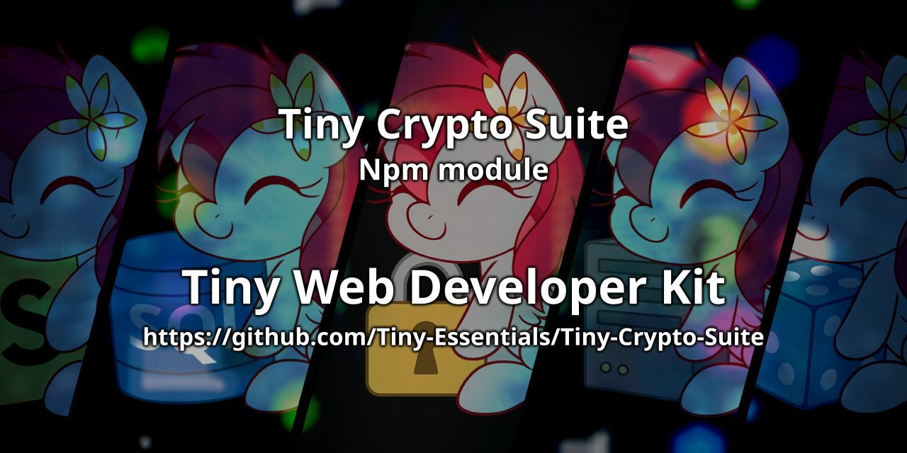

<div align="center">

<p>
    <a href="https://discord.gg/TgHdvJd"></a>
    <a href="https://www.npmjs.com/package/tiny-crypto-suite"></a>
    <a href="https://www.npmjs.com/package/tiny-crypto-suite"></a>
</p>
<p>
    <a href="https://www.patreon.com/JasminDreasond"></a>
    <a href="https://ko-fi.com/jasmindreasond"></a>
    <a href="https://chain.so/address/BTC/bc1qnk7upe44xrsll2tjhy5msg32zpnqxvyysyje2g"></a>
    <a href="https://chain.so/address/LTC/ltc1qchk520v4u8334n5dntmgeja55gc5g5rrkgpd4f"></a>
</p>
<p>
    <a href="https://nodei.co/npm/tiny-crypto-suite/"></a>
</p>
</div>

# 🔐 Tiny Crypto Suite

A modular cryptographic toolkit combining the powers of encryption to handle both **asymmetric (RSA)** and **symmetric (AES)** encryption tasks with ease.  
Built for modern apps that need to juggle certificates, keys, and encrypted data — across **Node.js** and **browser** environments. ✨

---

## 📁 What's Inside?

This suite is composed of **three powerful and lightweight modules**:

1. [`TinyCertCrypto`](#-tinycertcrypto) – Handles **X.509 certificates**, **RSA key pairs**, and **public/private encryption**.
2. [`TinyOlm`](./docs/TinyOlm) – Implements **Olm protocol** for **end-to-end encryption**, managing identity keys, sessions, and message exchange securely.
3. [`TinyCrypto`](#-tinycrypto) – Provides **AES-256-GCM** symmetric encryption and supports **complex JavaScript data types** out-of-the-box.

Together, they form a flexible system for secure communication, configuration handling, and data protection across platforms.

---

## 🛠️ Tiny-Essentials Fork Notice

Just a quick heads-up! 🚨 The object type imports from **Tiny-Essentials** have their own dedicated storage in this project. This happens because the `tiny-essentials-fork` extracts these scripts directly into our module to keep everything standalone.

To keep things organized and avoid naming conflicts, we renamed the core filter functions when exporting them. Here is a handy table showing the original Tiny-Essentials function names and how they are represented here:

| Original `tiny-essentials` Function | Exported Function in this Suite |
| :--- | :--- |
| `checkObj` | `checkCryptoObj` |
| `cloneObjTypeOrder` | `cloneCryptoObjTypeOrder` |
| `extendObjType` | `extendCryptoObjType` |
| `getCheckObj` | `getCheckCryptoObj` |
| `objType` | `cryptoObjType` |
| `reorderObjTypeOrder` | `reorderCryptoObjTypeOrder` |

📦 **Direct Access:** Good news! Our `package.json` is fully adapted with `exports`, meaning you can access these functions directly from the native file if you need to, like this:

```javascript
import { checkCryptoObj } from 'tiny-crypto-suite/tiny-modules/basics/objFilter';
```

---

## 🧩 Use Cases

- 🔐 Generate and validate X.509 certificates
- 📩 Send encrypted JSON between services using RSA
- 🗄️ Store encrypted configurations or secrets using AES
- 🧬 Serialize/deserialize sensitive objects securely
- 🌍 Build portable, encrypted apps that work both in browser and Node.js

---

## 📦 Installation

```bash
npm install tiny-crypto-suite
```

## Build 📦

To get started, please install the project dependencies. It is **mandatory** to run the build command afterward to ensure the module works correctly:
```bash
npm install
npm run build:essentials
```

---

## 🚀 Usage Example

```javascript
// Import the module
import { TinyCrypto, TinyCertCrypto } from 'tiny-crypto-suite';

// Create an instance of TinyCrypto
const crypto = new TinyCrypto();

// Create an instance of TinyCertCrypto (Node.js only for full features)
const tinyCert = new TinyCertCrypto({
  publicCertPath: 'cert.pem',
  privateKeyPath: 'key.pem'
});

tinyCert.startCrypto();

```

---

## ⚙️ Quick Overview

### 🔧 TinyCertCrypto

Use this when you need:

- RSA key generation (Node.js only)
- Self-signed X.509 certificates
- Public key encryption / Private key decryption
- Certificate metadata extraction
- PEM-based certificate management

➡️ Full documentation: [See TinyCertCrypto README](./docs/TinyCertCrypto.md)

---

### 🔒 TinyCrypto

Use this for:

- Fast and portable AES-256-GCM encryption
- Serializing JavaScript objects like `Date`, `Map`, `Set`, etc.
- Decrypting with type validation
- Saving/loading keys and configurations (Node.js + browser)

➡️ Full documentation: [See TinyCrypto README](./docs/TinyCrypto.md)

---

## 🎉 Summary

Whether you need high-level encrypted configs or low-level cert management, this suite has you covered:

- Use **TinyCertCrypto** to handle certificates, keys, and secure communication.
- Use **TinyCrypto** to serialize, encrypt, and store complex app data safely.
- Combine both for maximum flexibility and layered security. 🔐

## 📚 Documentation

Looking for detailed module explanations and usage examples?  
Check out the full documentation here:

👉 [Go to docs page](./docs/README.md)

## 🤝 Contributions

Feel free to fork, contribute, and create pull requests for improvements! Whether it's a bug fix or an additional feature, contributions are always welcome.

## 📝 License

This project is licensed under the LGPL-3.0 License - see the [LICENSE](LICENSE) file for details.

> 🧠 **Note**: This documentation was written by [ChatGPT](https://openai.com/chatgpt), an AI assistant developed by OpenAI, based on the project structure and descriptions provided by the repository author.  
> If you find any inaccuracies or need improvements, feel free to contribute or open an issue!

---

## 🔙 Back to Tiny Essentials

Did you like this module? It’s part of the **Tiny Essentials** collection — a set of minimal yet powerful tools to make development easier.
👉 [Click here to explore more Tiny Essentials modules](https://github.com/Tiny-Essentials/Tiny-Essentials)

---

<div align="center">
<a href="./img/"></a>
<br/>
Made with tiny love!
</div>